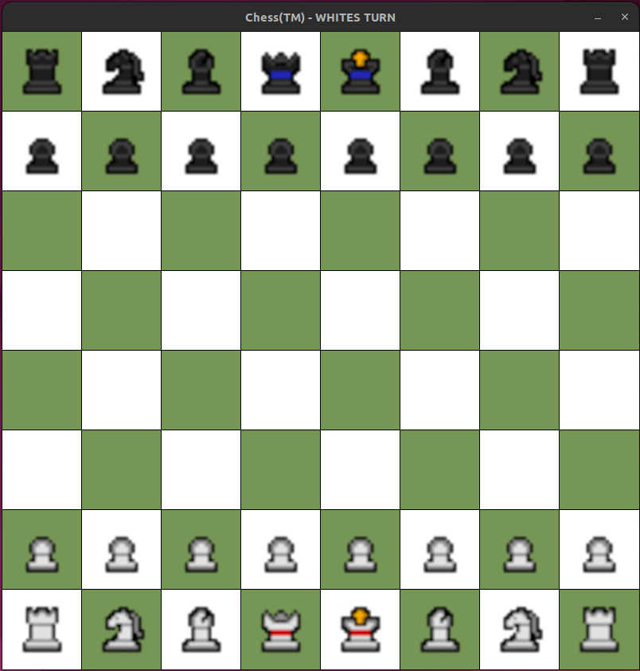
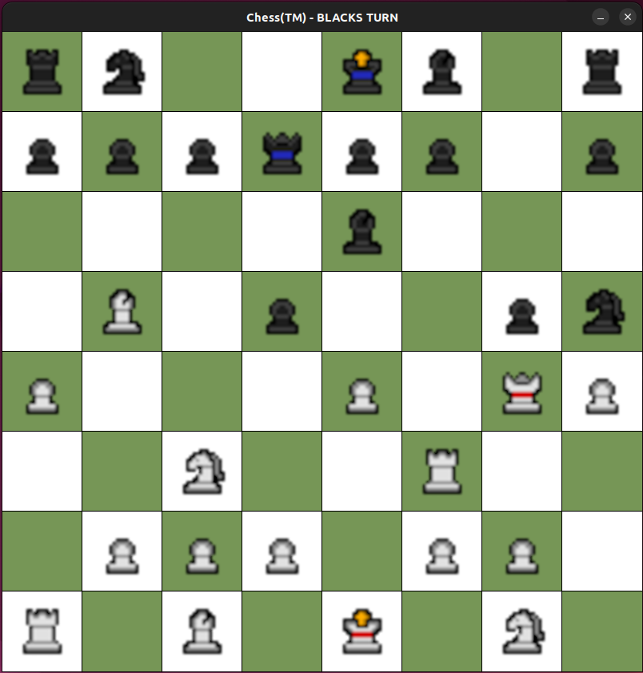

# Chess

## ScreenShots
### Start of game

  
### In play

  

## Game Features
### Highlight available moves
https://github.com/mark2661/Chess/assets/24856744/def2f412-c3f8-4124-b0c7-1d865691659d
### Force Resolve Check Scenarios
https://github.com/mark2661/Chess/assets/24856744/80d7e098-b71b-4d68-ae9a-f5be4e7b4414
### King Castling
https://github.com/mark2661/Chess/assets/24856744/862b35ee-6a43-46cb-8a90-ea05c61f6224
### En Passant Capture
https://github.com/mark2661/Chess/assets/24856744/1b1e61a2-44b5-4a9c-98de-e38342159d4f
### Pawn Promotion
https://github.com/mark2661/Chess/assets/24856744/96debca3-66b1-412d-a4bb-f8413fd1d53f
### Game Over Menu
https://github.com/mark2661/Chess/assets/24856744/63503d7a-5bbd-4734-9b92-6ee817ef82e6

